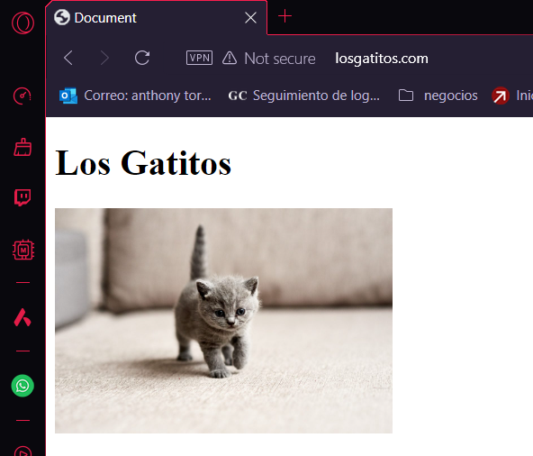

# Proyecto Laravel Form Scratch Anthony Torres Vargas

## Capítulo 5
- En el primer capítulo lo que se ve es simplemente cómo estára compuesto el proyecto final, con sus routes y views para cada página. Y cómo funcionan algunas cosas especificas de la síntaxsis.

## Resultado final
