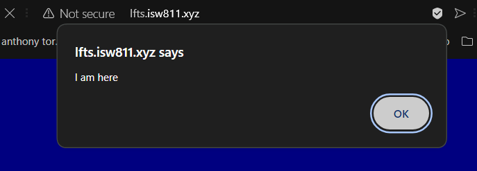
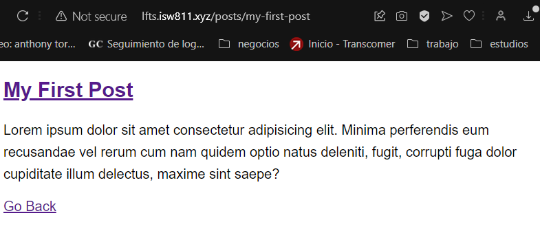

# Proyecto Laravel Form Scratch Anthony Torres Vargas

## Capítulo 5
- En este capítulo lo que se ve es simplemente cómo estára compuesto el proyecto final, con sus routes y views para cada página. Y cómo funcionan algunas cosas especificas de la síntaxsis.

## Capítulo 6
- En este capítulo se hizo usó básico de html, css y js

## Capítulo 7
- En este capítulo se empezó a implementar el blog y en el se realizó una página principal contenedora de 3 posts diferentes que al elegir alguno de ellos, nos lleva a otra página con ese post y un nuevo link que nos permité volver atrás.

## Capítulo 8
- En este capítulo se trabajó con los mismos 3 posts pero está vez de forma dinamica para que cuando se entre al link de un post te lleve a ese respectivamente.

## Capítulo 9
- En este capítulo se añadió una excepción a la URI de los posts para que sólo se acepten letras y guíones, así evitando que un usuario incluya links extraños.

## Capítulo 10
- En este capítulo se mejoró el código del redirect a post y además se añadio una exepción al cache para que su variable se mantenga por 1 hora y no se estén recargando cada vez que el usuario refresca la página.

## Capítulo 11
- En este capítulo 

## Capítulo 12
- En este capítulo 

## Capítulo 13
- En este capítulo 

## Capítulo 14
- En este capítulo 

## Capítulo 15
- En este capítulo 

## Capítulo 16
- En este capítulo 

## Capítulo 17
- En este capítulo 

## Capítulo 18
- En este capítulo 

## Capítulo 19
- En este capítulo 

## Capítulo 20
- En este capítulo 

## Capítulo 21
- En este capítulo 

## Capítulo 22
- En este capítulo 

## Capítulo 23
- En este capítulo 

## Capítulo 24
- En este capítulo 

## Capítulo 25
- En este capítulo 

## Capítulo 26
- En este capítulo 

## Capítulo 27
- En este capítulo 

## Capítulo 28
- En este capítulo 

## Capítulo 29
- En este capítulo 

## Capítulo 30
- En este capítulo 

## Capítulo 31
- En este capítulo 

## Capítulo 32
- En este capítulo 

## Capítulo 33
- En este capítulo 

## Capítulo 34
- En este capítulo 

## Capítulo 35
- En este capítulo 

## Capítulo 36
- En este capítulo 

## Resultado final
