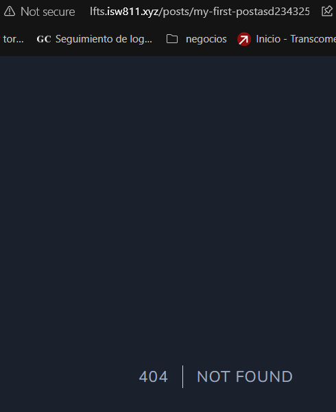

# Proyecto Laravel Form Scratch Anthony Torres Vargas

## Capítulo 5
- En este capítulo lo que se ve es simplemente cómo estára compuesto el proyecto final, con sus routes y views para cada página. Y cómo funcionan algunas cosas especificas de la síntaxsis.

## Capítulo 6
- En este capítulo se hizo usó básico de html, css y js

## Capítulo 7
- En este capítulo se empezó a implementar el blog y en el se realizó una página principal contenedora de 3 posts diferentes que al elegir alguno de ellos, nos lleva a otra página con ese post y un nuevo link que nos permité volver atrás.

## Capítulo 8
- En este capítulo se trabajó con los mismos 3 posts pero está vez de forma dinamica para que cuando se entre al link de un post te lleve a ese respectivamente.

## Capítulo 9
- En este capítulo se añadió una excepción a la URI de los posts para que sólo se acepten letras y guíones, así evitando que un usuario incluya links extraños.

## Capítulo 10
- En este capítulo se mejoró el código del redirect a post y además se añadio una exepción al cache para que su variable se mantenga por 1 hora y no se estén recargando cada vez que el usuario refresca la página.

## Capítulo 11
- En este capítulo se limpio aún más el código que teníamos haciendolo declarado y más sencillo de enternder, además se añadió una nueva función para cargar todos los posts que estén en la carpeta permitente de forma dinámica. Y por último se hizo una introducción a la metadata.

## Capítulo 12
- En este capítulo se hizo usó completo de la metadata haciendo que los documentos tengan información útil para mostrar cada uno de los post de forma eficiente y de forma totalmente dinámica.

## Capítulo 13
- En este capítulo final de lo básico se añadio un ordenamiento a los post y una forma de mantener la cache para siempre en el método All, la cuál no es tan conveniente.

## Capítulo 14
- En este capítulo se visualiza el poder de Blade y dan explicaciones del porqué es ciertamente más útil incluirlo en nuestro proyecto que usar php puro ya que nos facilita mucho el código que utilizamos y tenemos más alternativas.

## Capítulo 15
- En este capítulo vimos los blade layouts que básicamente permite crear layouts con información que podemos utilizar mucho durante la vida de un proyecto para evitar tener que escribirla varias veces y solo tener que reutilizarla de forma más eficaz. Además de los blade components que son layouts pero aún más fáciles de cargar.

## Capítulo 16
- En este capítulo se volvió a añadir el exeption para validar que el uri sea correcto y si no dar un 404

## Capítulo 17
- En este capítulo sólo se configura el .env y se explica un poco cómo funciona este archivo, se configura con la DB que se utilizará y se instala un gestor de DB para poder utilizarla más fácil

## Capítulo 18
- En este capítulo sólo se dió información sobre cómo funcionan los migrations y cómo podemos modificar las tablas que crea el mismo.

## Capítulo 19
- En este capítulo vimos porqué las tablas en la base de datos son elocuent y muchas de las funciones que podemos usar para trabajar con los usuario de nuestra base de datos.

## Capítulo 20
- En este capítulo se borró los models y post que teníamos anteriormente para crearlos de 0 pero está vez de forma más dinámica utilizando bases de datos para almacenarlos.

## Capítulo 21
- En este capítulo 

## Capítulo 22
- En este capítulo 

## Capítulo 23
- En este capítulo 

## Capítulo 24
- En este capítulo 

## Capítulo 25
- En este capítulo 

## Capítulo 26
- En este capítulo 

## Capítulo 27
- En este capítulo 

## Capítulo 28
- En este capítulo 

## Capítulo 29
- En este capítulo 

## Capítulo 30
- En este capítulo 

## Capítulo 31
- En este capítulo 

## Capítulo 32
- En este capítulo 

## Capítulo 33
- En este capítulo 

## Capítulo 34
- En este capítulo 

## Capítulo 35
- En este capítulo 

## Capítulo 36
- En este capítulo 

## Resultado final
